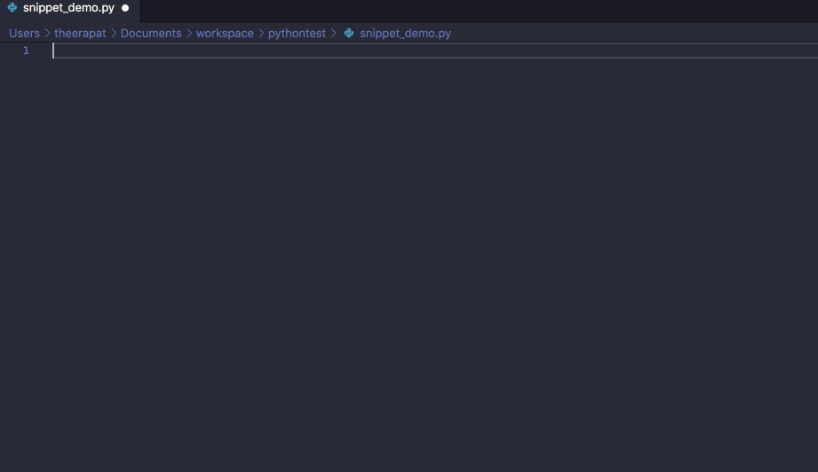

# Settrade OpenAPI Python SDK Code Snippet Generator

Code generator for Visual Studio Code

## Installation

Install this extension(settrade-python-sdk-snippet) in Visual Studio Code.

## How to use

1. Install this extension in VS Code.
2. Create python file (.py extension)
3. Type a part of snippet name and select a desired snippet from dropdown

## Available Snippets

### Common snippet

| Snippet                        | Description                                                    | Ref  |
| ------------------------------ | -------------------------------------------------------------- | ---- |
| `stt-investor-import`          | Import Settrade OpenAPI Python SDK module                      |      |
| `stt-investor-login`           | Login to Settrade OpenAPI as an investor                       |      |

### Market Data snippet

| Snippet                              | Description                                                              | Ref  |
| ------------------------------------ | ------------------------------------------------------------------------ | ---- |
| `stt-investor-subscribe-price`       | Subscribe for realtime price information of a specific symbol            |      |
| `stt-investor-subscribe-bids-offers` | Subscribe for realtime bids and offers information of a specific symbol  |      |

### Derivatives Market snippet

| Snippet                              | Description                                     | Ref  |
| ------------------------------------ | ----------------------------------------------- | ---- |
| `stt-investor-deriv-account`         | Get investor derivatives account info           |      |
| `stt-investor-deriv-place-order`     | Place investor derivatives order                |      |
| `stt-investor-deriv-get-order`       | Get investor derivatives order                  |      |
| `stt-investor-deriv-list-orders`     | List investor derivatives orders                |      |
| `stt-investor-deriv-change-order`    | Change investor derivatives order               |      |
| `stt-investor-deriv-cancel-order`    | Cancel investor derivatives order               |      |
| `stt-investor-deriv-get-portfolio`   | Get investor derivatives portfolio              |      |
| `stt-investor-deriv-subscribe-order` | Subscribe for realtime derivatives order status |      |

### Equity Market snippet

| Snippet                               | Description                                 | Ref  |
| ------------------------------------- | :------------------------------------------ | ---- |
| `stt-investor-equity-place-order`     | Place investor equity order                 |      |
| `stt-investor-equity-get-order`       | Get investor equity order                   |      |
| `stt-investor-equity-list-orders`     | List investor equity orders                 |      |
| `stt-investor-equity-change-order`    | Change investor equity order                |      |
| `stt-investor-equity-cancel-order`    | Cancel investor equity order                |      |
| `stt-investor-equity-get-portfolio`   | Get investor equity portfolio               |      |
| `stt-investor-equity-subscribe-order` | Subscribe for realtime equity order status  |      |

## Release Notes

### 0.1.0

Initial release.

Supports Python snippets for the following function:

- Investor Login: `stt-investor-login`
- Market Data
  - Subscribe realtime symbol price
  - Subscribe realtime symbol bids/offers
- Derivatives
  - Get Account Info
  - Place Order
  - Get Order
  - List Orders
  - Change Order
  - Cancel Order
  - Subscribe Order Status
- Equity
  - Get Account Info
  - Place Order
  - Get Order
  - List Orders
  - Change Order
  - Cancel Order
  - Subscribe Order Status

## Reference

[Settrade OpenAPI Website](https://developer.settrade.com/open-api)

----

